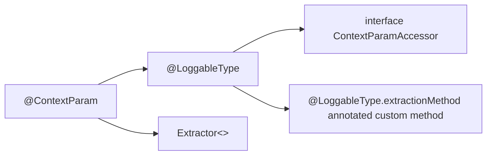

#  Log Structured Data 4 Java (lsd4j)

### Overview ###

This approach was created to make application logging unified and produce sensible logs in a single format that is recognizable by log parsing software (LogStash, etc).

### Requirements ###

Java >= 1.8

### Installation ###

Maven
```xml
<dependency>
   <groupId>com.nixsolutions</groupId>
   <artifactId>lsd4j</artifactId>
   <version>${lsd4j.version}</version>
</dependency>
```

Gradle
```xml 
compile group: 'com.nixsolutions', name: 'lsd4j', version: '1.0.SNAPSHOT'
```

### Quickstart ###

# Declarative structured logging

Lsd4j has mechanism to create structured logs with annotation driven approach. This is flexible and easy to use mechanism, that allows you to create structured logs in various ways.

Main annotation that helps to create logs is **@ContextParam**. With this annotation you can mark method parameter as loggable. This means that parameter which marked with this annotation will be processed with lsd4j mechanism and will be added to context logging map.

For example you have method doSomething with two parameters and you want to log the second parameter. All that you need is to mark parameter with @ContextParam annotation.

    public void doSomething(String firstParam, @ContextParam User secondParam) {
	    . . .
    }
    
## Structured logs extracting approaches

Lsd4j has two main concepts of logging logic, which you can use in your application. There are creation of custom extractor and marking class with @LoggableType annotation properties with subtypes of this annotation. Let's go through these methods.

    public class User {
	    private String name;
	    private String surname;
	    private int age;
	    
	    . . .
    }

If you want to create structured log for User object, you need to do some preparation.
For creating structured logs for type you need to create extractor for this type or mark your class with **@LoggableType** annotation.



  
## Extractors

Let's try to create extractor for class User. LSD4J has base extractor interface - **ContextParamExtractor**. This interface has **extractParams()** and **getExtractableClases()** methods that have to be implemented. extractParams method returns context logging map - Map<String, Object> with fields that need to be logged from your object.

For example if you want to create log message for name and surname fields from User type, you need to create special extractor for User type, which implements ContextParamExtractor<User> and override extractParams and getExtractableClases methods.

    @Component
    public class UserExtractor implements ContextParamExtractor<User> {
	    @Override
	    public Map<String, Object> extractParams(String name, User parameter) {
		if (name.isEmpty())
		{
		    return ImmutableMap.of("userName", parameter.name,"userSurname", parameter.surname);
		} else {
		    return ImmutableMap.of();
		}
	    }
	    
	    @Override
	    public List<Class<?>> getExtractableClasses() {
		    return Arrays.asList(User.class);
	    }
	}

With UserExtractor mechanism of lsd4j will understand what fields of User type will be added to context logging map. As a result will be created context logging map with two field: name and surname with corresponding keys.

## @LoggableType annotation and methods

The second way to create structured logs from POJO object is to annotate class with **@LoggableType** annotation. This approach have two ways to be implemented:

-   Implement ContextParamAccessor and override extractParams method.
-   Create custom method and annotate it with @LoggableType.extractionMethod annotation
    
Firstly we will look at first approach. For example we have User class and we want to log some fields from this class. First of all we need to annotate our class with @LoggableType annotation. This means that the User type will be processed with lsd4j Lookup Strategy (will be reviewed later) and marked as Loggable type.

The second step is to implement **ContextParamAccessor** on your POJO class, in our case it’s User class and override extractParams method.  
  

    @LoggableType
    public class User implements ContextParamAccessor {
	    private String name;
	    private String surname;
	    private int age;
    
	    @Override
	    public Map<String, Object> extractParams() {
		    return ImmutableMap.of("userName", parameter.name,"userSurname", parameter.surname);
	    }

In this case implemented from interface method will extract class fields, that mention in this method to context logging map.

So when some method want to create structured logs from POJO object, with lsd4j mechanism will be called implemented method and will be created context logging map with fields, which was mentioned in extractParams method.

Lsd4j has similar way to create custom method for extracting class fields to log structured logs. You need to annotate class with @LoggableType annotation and create custom method, which will return Map<String, Object>. But for this case you don’t need to implement ContextParamAccessor interface. All that you need is to annotate your custom method with **@LoggableType.extractionMethod** annotation.

    @LoggableType
    public class User {
	    private String name;
	    private String surname;
	    private int age;
      
	    @LoggableType.extractionMethod
	    public Map<String, Object> extractParams() {
	    	return ImmutableMap.of("userName", parameter.name,"userSurname", parameter.surname);
	    }

So when some method want to create structured logs from POJO object, with lsd4j mechanism will be called implemented method and will be created context logging map with fields, which was mentioned in your custom method.

## Logging Annotations Overview

### @DoLog.entry

You can annotate public methods with **@Log.entry** annotation to write log message with _DEBUG_ log level when method execution is started. Log message will contain:
* Method name
* Context information for method arguments. Context information for method argument will be included into log message if it is annotated with **[@ContextParam](#extractors)** or/and class of method argument is annotated with **[@LoggableType](#loggabletype-annotation-and-methods)**.

### @DoLog.exit

You can annotate public methods with **@Log.exit** annotation to write log message when method execution is finished. 

Log message will contain:
* Method name
* Context information for method arguments. Context information for method argument will be included into log message if it is annotated with **[@ContextParam](#extractors)** or/and class of method argument is annotated with **[@LoggableType](#loggabletype-annotation-and-methods)**.
* Exception, if method was completed unsuccessfully. 

In exceptional case the log message will have _ERROR_ level, otherwise - _DEBUG_ level.

### @DoLog.exectime

You can annotate public methods with **@Log.exectime** annotation to write log message with _DEBUG_ log level when method was completed. 

This annotation can have next arguments:
* **taskName** - The name of the task which will be displayed in log message (optional argument). If task name was not specified - method name will be used instead of.
* **timeUnit** - time unit for method execution time (optional argument). By default it’s millisecond.

The log message will contain:
* Task name
* Method duration
* Time unit

### @DoLog

You should annotate method with this annotation if you want enable **[@DoLog.entry](#dologentry)**, **[@DoLog.exit](#dologexit)** and **[@DoLog.exectime](#dologexectime)** annotations.
It means that if you want to log when method started, method finished and execution time you should annotate method in the following way:
```
    @DoLog
    @DoLog.entry
    @DoLog.exit
    @DoLog.exectime
    public void methodA()
    {
        ...
    }
```

TBD